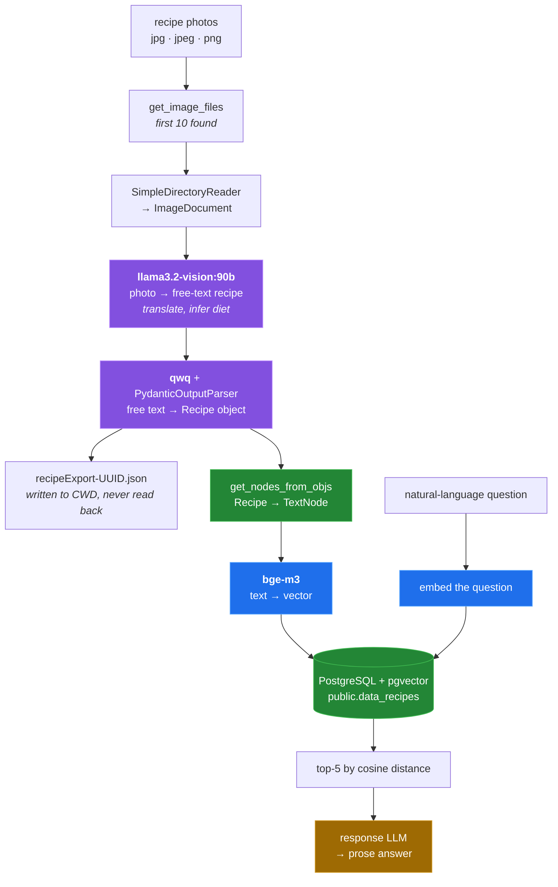
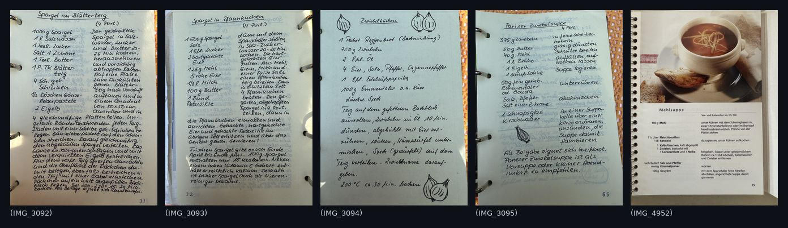

# cookingRAG


**Reads recipes out of photographs with a local vision model and makes them
searchable in natural language.** Point it at a folder of cookbook scans or
handwritten recipe cards; it extracts each one into a structured object, embeds
it, and stores it in PostgreSQL with pgvector. Nothing leaves the machine — the
vision model, the structuring model and the embedding model all run under
Ollama.

It is a small experiment, not a product. Ten of the fifteen defects this
documentation describes have since been fixed on the default branch; the
[known limitations](#known-limitations) separate what is still open from what
was repaired, and are worth reading before you try to use it.

## The pipeline



Three models, one database, no chunking — a recipe is one row. Amber marks the
step with no model configured ([why](docs/05-query.md)).

## Quick start

**This quick start has not been run end to end with the models.** In a Linux
container against a pgvector server, `pip install -r requirements.txt` succeeds,
both entry points start, and the database is created; the model steps were not
run because the containers have no Ollama models. See
[docs/measurement.md](docs/measurement.md).

```sh
git clone https://github.com/Bissbert/cookingRAG.git
cd cookingRAG

python3 -m venv venv && . venv/bin/activate

pip install -r requirements.txt

# All three models are required. The vision model is a ~55 GB download.
ollama pull llama3.2-vision:90b
ollama pull qwq
ollama pull bge-m3

# PostgreSQL with pgvector, and a role that may CREATE DATABASE
export PG_PASSWORD=yourpassword

python ingest_recipes.py ./testRecipes
python query_recipes.py something vegetarian with onions
```

Two corrections to the previous instructions:

- `bge-m3` must be pulled as well. It was not listed, and ingestion cannot
  embed without it.
- `query_recipes.py` takes the query as a **required** positional argument
  (`nargs='+'`). `python query_recipes.py` with no arguments is an argparse
  error.

No OpenAI key is needed: `query_recipes.py` embeds the question with `bge-m3`
and answers with `qwq`, the same models ingestion uses.

## Requirements

| | Needed | Notes |
|---|---|---|
| Python | 3.12 tested | `requirements.txt` installs cleanly in `python:3.12-slim-bookworm`. |
| Ollama | daemon on `localhost:11434` | The embedder reads `OLLAMA_BASE_URL`; the vision and chat models are hard-coded to the default. `OLLAMA_HOST` is not honoured. |
| `llama3.2-vision:90b` | image → text | ~55 GB. `:11b` is a one-line substitution, unevaluated here. |
| `qwq` | text → structured `Recipe` | |
| `bge-m3` | embeddings | Not mentioned in the previous README. |
| PostgreSQL | with `pgvector` | Needs `CREATEDB` and permission to `CREATE EXTENSION`. |

`python3 tools/envcheck.py` checks all of these and tells you which are missing.

## What it was tested on

`testRecipes/` holds the five images the author ingested, shown here at 260 px
wide:



Four handwritten German cursive pages from a ring binder, one printed cookbook
page. The repository also contains
`recipeExport-3889e5c2-fd85-4e50-8a61-024a12744127.json`, committed after a real
ingest of exactly these five images — the only surviving output of a working
run. Comparing it against the pictures:

| Image | Recipe on the page | Title extracted |
|---|---|---|
| `IMG_3092` | Spargel im Blätterteig | Spaetzle im Brei |
| `IMG_3093` | Spargel in Pfannkuchen | Spaetzle im Brei |
| `IMG_3094` | Zwiebelkuchen | Spaetzle im Brei |
| `IMG_3095` | Pariser Zwiebelsuppe | Spaetzle im Brei |
| `IMG_4952` | Mehlsuppe *(printed)* | Mehlsuppe mit Brötchen und Eier |

The printed page came through recognisably. All four handwritten pages collapsed
onto one title that appears nowhere in the corpus. The output was also entirely
in German despite the prompt demanding English, and the soup built on veal stock
was labelled `vegetarian`.

This is **one run, n = 5, unknown model build, unknown date** — evidence about
that run, not a benchmark. No accuracy score was computed from it. It is here
because it is the only empirical thing the repository contains, and because the
failure is silent: schema-valid JSON, well-formed, wrong.
[Details](docs/02-extraction.md).

## Repository layout

```
ingest_recipes.py     entry point: folder of images → vector store
query_recipes.py      entry point: natural-language question → answer
util/                 the five modules the pipeline is built from
testRecipes/          five real recipe photographs
recipeExport-*.json   output of one real ingest run, committed
docs/                 a write-up per pipeline stage, plus methodology
tools/                the scripts that produced every number in the docs,
                      and linux-run.sh, which runs them all in containers
tests/                pytest suite; sh tests/docker.sh runs it in containers
media/                generated figures
```

| File | Lines | Bytes |
| --- | ---: | ---: |
| `ingest_recipes.py` | 127 | 3,863 |
| `query_recipes.py` | 44 | 1,448 |
| `util/recipe.py` | 32 | 1,498 |
| `util/json_util.py` | 15 | 411 |
| `util/embedding_util.py` | 82 | 2,777 |
| `util/database_conection.py` | 67 | 2,366 |
| `util/ingestion_model_interaction.py` | 164 | 5,718 |
| **total** | **531** | **18,081** |

→ [Full documentation](docs/README.md) ·
[how this was measured](docs/measurement.md) ·
[open issues](https://github.com/Bissbert/cookingRAG/issues)

## What lands in PostgreSQL

One row per recipe, in `public.data_recipes` — note the `data_` prefix that
`llama_index` adds to the configured name `recipes`:

```sql
CREATE TABLE public.data_recipes (
	id BIGSERIAL NOT NULL,
	text VARCHAR NOT NULL,
	metadata_ JSON,
	node_id VARCHAR,
	embedding VECTOR(1024),
	PRIMARY KEY (id)
)
```

No HNSW or IVFFlat index is created, so similarity search is a sequential scan
with cosine distance — sensible at this scale, but worth knowing.
[Details](docs/04-storage.md).

## Known limitations

Defects are tracked as
[GitHub issues](https://github.com/Bissbert/cookingRAG/issues). These are the
limits of the design and of the one recorded run:

- **At most 10 images per run.** `sample=10` is hard-coded with no CLI flag.
  The order is now the discovered order unless `shuffle=True` is passed.
- **Extraction on handwriting was not reliable** in the one recorded run: four
  of five images produced the same wrong title. Not quantified beyond that.
- **The vision prompt's translation instruction was not followed** in the
  recorded run; all output stayed in German.
- **Dietary inference is unverified and was wrong at least once** — a veal-stock
  soup was labelled `vegetarian`. Do not rely on this field for anything that
  matters.
- **Configuration is read at import time.** Setting an environment variable
  after `util/database_conection.py` or `util/embedding_util.py` is imported has
  no effect.
- **A cloned repository packs to ~78 MiB.** A virtualenv was committed in
  the initial commit and deleted in `7e9c095f`; the blobs remain in history and
  account for **99.1 %** of all object bytes. Deleting files does not shrink
  history — only a rewrite would. `python3 tools/repo_size.py` shows the
  breakdown.

## Configuration

| Variable | Default | If unset |
|---|---|---|
| `PG_HOST` | `localhost` | fine |
| `PG_PORT` | `5432` | fine |
| `PG_USER` | `postgres` | fine; needs `CREATEDB` |
| `PG_PASSWORD` | `your_database_password` | **breaks** — the literal default is sent and authentication fails |
| `PG_DB_NAME` | `recipe_db` | fine |

| `EMBED_MODEL` | `bge-m3` | fine |
| `OLLAMA_BASE_URL` | `http://localhost:11434` | fine; used by the embedder only |
| `EMBED_DIM` | width of `EMBED_MODEL` (1024 for `bge-m3`) | fine; set it for a model the code does not know, or it is probed once |

The vision and chat model names, the table name, timeouts, retry counts and
`similarity_top_k` are hard-coded.
[Full table, with line numbers](docs/06-configuration.md).

## Status

Experimental. Ingestion runs end to end when the models and the database are
present, the query entry point imports and reads the persisted vectors, and the
indexing step now embeds ingredients and instructions. The query path uses the
same local models as ingestion, and the vector column is sized from the
embedding model. A pytest suite covers these paths with the models faked
(`sh tests/docker.sh`). Treat it as a working sketch of a local RAG
pipeline rather than something to put recipes into and trust.

## License

MIT — see [LICENSE](LICENSE).
