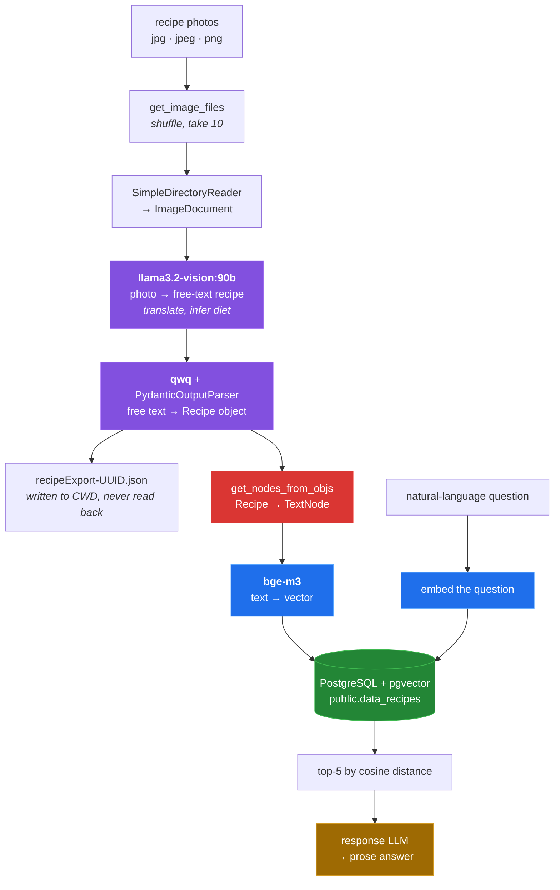

# cookingRAG


**Reads recipes out of photographs with a local vision model and makes them
searchable in natural language.** Point it at a folder of cookbook scans or
handwritten recipe cards; it extracts each one into a structured object, embeds
it, and stores it in PostgreSQL with pgvector. Nothing leaves the machine — the
vision model, the structuring model and the embedding model all run under
Ollama.

It is a 480-line experiment, not a product, and parts of it do not currently
work. The [known limitations](#known-limitations) are specific and are worth
reading before you try to use it.

## The pipeline



Three models, one database, no chunking — a recipe is one row. Red marks the
step that loses data ([why](docs/03-indexing.md)); amber marks the step with no
model configured ([why](docs/05-query.md)).

## Quick start

**This quick start has not been run end to end.** No machine available while
writing it had the models and a pgvector server at the same time; the commands
below are derived from the source, and the two places where the previous README
did not match the code are corrected. See
[docs/measurement.md](docs/measurement.md).

```sh
git clone https://github.com/Bissbert/cookingRAG.git
cd cookingRAG

python3 -m venv venv && . venv/bin/activate

# NOTE: requirements.txt does not resolve as committed - see below
pip install -r requirements.txt

# All three models are required. The vision model is a ~55 GB download.
ollama pull llama3.2-vision:90b
ollama pull qwq
ollama pull bge-m3

# PostgreSQL with pgvector, and a role that may CREATE DATABASE
export PG_PASSWORD=yourpassword

python ingest_recipes.py ./testRecipes
python query_recipes.py something vegetarian with onions
```

Two corrections to the previous instructions:

- `bge-m3` must be pulled as well. It was not listed, and ingestion cannot
  embed without it.
- `query_recipes.py` takes the query as a **required** positional argument
  (`nargs='+'`). `python query_recipes.py` with no arguments is an argparse
  error.

And one thing the commands above will not survive: `pip install -r
requirements.txt` fails as committed.

```
ERROR: Cannot install -r requirements.txt (line 8) and pydantic==1.10.17
because these package versions have conflicting dependencies.
    The user requested pydantic==1.10.17
    llama-index-core 0.12.2 depends on pydantic<2.10.0 and >=2.7.0
ERROR: ResolutionImpossible
```

Deleting the `pydantic==1.10.17` line lets the rest install cleanly; pip then
picks pydantic 2.9.2. That is a real fix to a real conflict, but it is a change
to a checked-in file and has been left for the maintainer to make.

## Requirements

| | Needed | Notes |
|---|---|---|
| Python | 3.11 tested | `requirements.txt` needs the pydantic pin dropped. |
| Ollama | daemon on `localhost:11434` | Hard-coded; `OLLAMA_HOST` is not honoured. |
| `llama3.2-vision:90b` | image → text | ~55 GB. `:11b` is a one-line substitution, unevaluated here. |
| `qwq` | text → structured `Recipe` | |
| `bge-m3` | embeddings | Not mentioned in the previous README. |
| PostgreSQL | with `pgvector` | Needs `CREATEDB` and permission to `CREATE EXTENSION`. |

`python3 tools/envcheck.py` checks all of these and tells you which are missing.

## What it was tested on

`testRecipes/` holds the five images the author ingested, shown here at 260 px
wide:


Four handwritten German cursive pages from a ring binder, one printed cookbook
page. The repository also contains
`recipeExport-3889e5c2-fd85-4e50-8a61-024a12744127.json`, committed after a real
ingest of exactly these five images — the only surviving output of a working
run. Comparing it against the pictures:

| Image | Recipe on the page | Title extracted |
|---|---|---|
| `IMG_3092` | Spargel im Blätterteig | Spaetzle im Brei |
| `IMG_3093` | Spargel in Pfannkuchen | Spaetzle im Brei |
| `IMG_3094` | Zwiebelkuchen | Spaetzle im Brei |
| `IMG_3095` | Pariser Zwiebelsuppe | Spaetzle im Brei |
| `IMG_4952` | Mehlsuppe *(printed)* | Mehlsuppe mit Brötchen und Eier |

The printed page came through recognisably. All four handwritten pages collapsed
onto one title that appears nowhere in the corpus. The output was also entirely
in German despite the prompt demanding English, and the soup built on veal stock
was labelled `vegetarian`.

This is **one run, n = 5, unknown model build, unknown date** — evidence about
that run, not a benchmark. No accuracy score was computed from it. It is here
because it is the only empirical thing the repository contains, and because the
failure is silent: schema-valid JSON, well-formed, wrong.
[Details](docs/02-extraction.md).

## Repository layout

```
ingest_recipes.py     entry point: folder of images → vector store
query_recipes.py      entry point: natural-language question → answer
util/                 the five modules the pipeline is built from
testRecipes/          five real recipe photographs
recipeExport-*.json   output of one real ingest run, committed
docs/                 a write-up per pipeline stage, plus methodology
tools/                the scripts that produced every number in the docs
media/                generated figures
```

| File | Lines | Bytes |
| --- | ---: | ---: |
| `ingest_recipes.py` | 126 | 3,843 |
| `query_recipes.py` | 51 | 1,683 |
| `util/recipe.py` | 31 | 1,567 |
| `util/json_util.py` | 15 | 411 |
| `util/embedding_util.py` | 55 | 1,842 |
| `util/database_conection.py` | 62 | 2,254 |
| `util/ingestion_model_interaction.py` | 140 | 5,100 |
| **total** | **480** | **16,700** |

→ [Full documentation](docs/README.md) ·
[how this was measured](docs/measurement.md) ·
[bugs found](docs/BUGS-FOUND.md)

## What lands in PostgreSQL

One row per recipe, in `public.data_recipes` — note the `data_` prefix that
`llama_index` adds to the configured name `recipes`:

```sql
CREATE TABLE public.data_recipes (
	id BIGSERIAL NOT NULL,
	text VARCHAR NOT NULL,
	metadata_ JSON,
	node_id VARCHAR,
	embedding VECTOR(1536),
	PRIMARY KEY (id)
)
```

No HNSW or IVFFlat index is created, so similarity search is a sequential scan
with cosine distance — sensible at this scale, but worth knowing.
[Details](docs/04-storage.md).

## Known limitations

Ordered by how much they affect the result. Each defect below is written up in
full in [docs/BUGS-FOUND.md](docs/BUGS-FOUND.md) — file and line, how to
reproduce it, and the fix that would resolve it as a diff. **None of them is
fixed in this branch**, which is documentation-only.

- **Ingredients and instructions are never embedded.**
  `get_nodes_from_objs()` reads `recipe.instructions` and `item.ingredient` /
  `item.amount`, but the current `Recipe` has `instructionsAsString` and a plain
  `List[str]` of ingredients. Every read is a `getattr` with a default, so
  nothing raises — each ingredient renders as `- : ` and the instruction loop
  never runs. The stored text is title and cook time only. A query for
  "something with lentils" cannot match on "lentils".
  [Details](docs/03-indexing.md).
- **`query_recipes.py` does not import.** It uses the pre-0.10 flat
  `llama_index` layout against the pinned 0.12.2. Behind that are three more
  problems: the index is constructed without nodes instead of with
  `from_vector_store`, no response LLM is configured (so `llama_index` would
  fall back to OpenAI, contradicting the local-only premise), and no embedding
  model is set for the question. [Details](docs/05-query.md).
- **`requirements.txt` does not resolve.** The `pydantic==1.10.17` pin
  contradicts `llama-index-core` 0.12.2.
- **Extraction on handwriting was not reliable** in the one recorded run: four
  of five images produced the same wrong title. Not quantified beyond that.
- **`initModel()` is an empty function.** Its only statement is commented out,
  so `Settings.llm` is never set anywhere in the project.
- **At most 10 images per run, chosen at random.** `sample=10` and an
  unconditional `random.shuffle()` are both hard-coded with no CLI flag. The
  `shuffle` parameter is declared and never read.
- **Ingestion is sequential despite the async scaffolding.**
  `aprocess_image_file` is a synchronous function called in a plain loop; the
  `run_jobs(..., workers=5)` call is commented out. Two model round-trips per
  image, one image at a time.
- **One failure loses the whole run.** The JSON export and the database write
  both happen only after every image is processed, and there is no per-image
  error handling.
- **`embed_dim=1536` is hard-coded** while the embedding model is `bge-m3`. 1536
  is the OpenAI/`PGVectorStore` default. The width bge-m3 actually returns was
  **not measured** here — the model was not available. A mismatch would fail
  loudly on first insert. [Details](docs/04-storage.md).
- **The vision prompt's translation instruction was not followed** in the
  recorded run; all output stayed in German.
- **Dietary inference is unverified and was wrong at least once** — a veal-stock
  soup was labelled `vegetarian`. Do not rely on this field for anything that
  matters.
- **Configuration is read at import time** and duplicated verbatim between
  `util/database_conection.py:7-11` and `query_recipes.py:11-15`. The two copies
  are currently byte-identical, so nothing has diverged yet — but any change has
  to be made twice, by hand.
- **`PG_DB_NAME` is interpolated unquoted** into `CREATE DATABASE`, on an
  autocommit connection held by a role with `CREATEDB`
  ([BUG-08](docs/BUGS-FOUND.md#bug-08)).
- **The vision-model retry loop catches only `ResponseError`**, so a timeout or
  a dropped connection is not retried, and by the point above takes the whole
  run with it ([BUG-14](docs/BUGS-FOUND.md#bug-14)).
- **The `Recipe` docstring contradicts its own fields**: it documents
  `dietary_preference` as a three-value `Literal`, but the field is an
  unconstrained `str` ([BUG-15](docs/BUGS-FOUND.md#bug-15)).
- **A cloned repository is ~78 MiB for 17 files.** A virtualenv was committed in
  the initial commit and deleted in `7e9c095f`; the blobs remain in history and
  account for **99.3 %** of all object bytes. Deleting files does not shrink
  history — only a rewrite would. `python3 tools/repo_size.py` shows the
  breakdown.

## Configuration

| Variable | Default | If unset |
|---|---|---|
| `PG_HOST` | `localhost` | fine |
| `PG_PORT` | `5432` | fine |
| `PG_USER` | `postgres` | fine; needs `CREATEDB` |
| `PG_PASSWORD` | `your_database_password` | **breaks** — the literal default is sent and authentication fails |
| `PG_DB_NAME` | `recipe_db` | fine |

Model names, the Ollama URL, the table name, `embed_dim`, timeouts, retry counts
and `similarity_top_k` are all hard-coded.
[Full table, with line numbers](docs/06-configuration.md).

## Status

Experimental. Ingestion runs end to end when the models and the database are
present; the query entry point does not currently import, and the indexing step
discards most of each recipe. Treat it as a working sketch of a local RAG
pipeline rather than something to put recipes into and trust.

## License

MIT — see [LICENSE](LICENSE).
