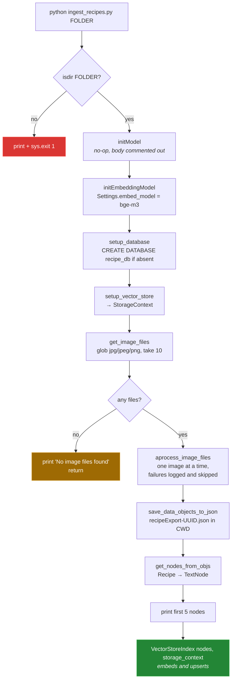

# 1 — Ingestion: `ingest_recipes.py`

[← back to the overview](../README.md) · source:
[`ingest_recipes.py`](../ingest_recipes.py) · 127 lines · 3,863 bytes

The only entry point that runs. It takes one argument — a directory of images —
and walks it through the whole pipeline: pick files, extract recipes, dump a
JSON export, build nodes, embed, store.

```sh
python ingest_recipes.py /path/to/recipe/photos
```

## The run



The final `VectorStoreIndex(...)` call is what actually writes to PostgreSQL.
Constructing the index embeds every node and upserts it; the return value is
assigned to a local `index` that is never used, which is fine — the side effect
is the point.

## File selection

`get_image_files()` is the one place where behaviour may surprise:

| Aspect | Behaviour |
|---|---|
| Extensions | `*.jpg`, `*.jpeg`, `*.png` only. Case-sensitive globs, so `.JPG` is skipped. |
| Recursion | None. `Path.glob` without `**`, so subdirectories are ignored. |
| Ordering | The order the globs return: all `.jpg`, then `.jpeg`, then `.png`, each in directory order, which is not sorted. |
| Sampling | `sample` defaults to `10`, so at most 10 images per run. |
| `shuffle` parameter | Defaults to `False`; `random.shuffle()` runs only when it is `True`. |

Both defaults are baked in — `process_recipe_images()` calls
`get_image_files(folder_path)` with no overrides, and there is no CLI flag for
either. Pointing the script at a folder of 50 photos processes the first 10 the
filesystem lists, and the other 40 are never reached.

## The JSON export

Before anything touches the database, every extracted `Recipe` is serialised:

```python
filename = f"recipeExport-{uuid.uuid4()}.json"
filepath = os.path.join(os.getcwd(), filename)
```

Written to the **current working directory**, not the image folder and not a
fixed output directory, with a fresh UUID each run. Nothing ever reads these
files back; they are a one-way debugging artifact. One of them is committed at
the repository root — see [02 — Extraction](02-extraction.md), which uses it as
the only surviving evidence of a real run.

`recipes_to_json()` in `util/json_util.py` calls `recipe.dict()`. Under the
pydantic 2.x that `llama_index` 0.12.2 requires, this still works but emits
`PydanticDeprecatedSince20: The 'dict' method is deprecated; use 'model_dump'
instead`.

## Concurrency

`ingest_recipes.py` is built as an async program — `asyncio.run(main())`, an
`async def process_recipe_images`, an awaited `aprocess_image_files`. None of it
runs concurrently:

```python
async def aprocess_image_files(image_files):
    outputs = []
    for image_file in image_files:
        output = aprocess_image_file(image_file)   # plain sync call
        outputs.append(output)
    return outputs
```

`aprocess_image_file` is a regular `def`, so the loop blocks on each image in
turn. The commented-out line just below it shows the intent:

```python
#outputs = await run_jobs(tasks, show_progress=True, workers=5)
```

`run_jobs` is still imported. As written, images are processed strictly
sequentially, and each one costs two full model round-trips.

## Failure behaviour

`aprocess_image_files` wraps each image in its own `try`. When
`pydantic_llm()` gives up on an image, the exception is logged with its
traceback, the file is added to a failed list, and the loop moves on. At the
end a warning names every file that failed, and the successful results go on
to the JSON export and the database write.

There is no checkpoint. The export and the database write still happen only
after every image has been attempted, so killing the process part-way loses
the whole run, and re-running processes every image again.

## Next

[02 — Extraction](02-extraction.md): what the two models do with each image.
