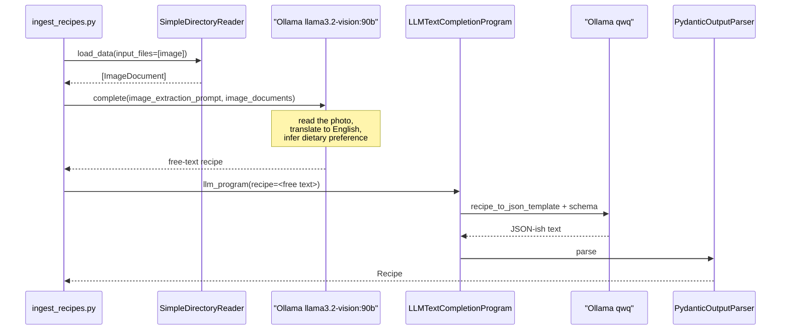

# 2 — Extraction: `util/ingestion_model_interaction.py`

[← back to the overview](../README.md) · source:
[`util/ingestion_model_interaction.py`](../util/ingestion_model_interaction.py)
· 164 lines · 5,718 bytes

The largest module in the repository, and the only one that talks to a model.
It turns one image into one `Recipe` object using two Ollama models in series:
a vision model reads the picture into free text, then a text model reshapes that
text into JSON matching the Pydantic schema.

## Two models, two hops



Both hops are wrapped in the same retry shape: **3 attempts, 5 seconds apart**,
then re-raise. Both catch the same tuple, `RETRYABLE_EXCEPTIONS`:

| Hop | Model | Timeout | Retries on |
|---|---|---|---|
| Image → text | `llama3.2-vision:90b` | 600 s | `ResponseError`, `httpx.TransportError`, `TimeoutError`, `ConnectionError` |
| Text → `Recipe` | `qwq` | 600 s | the same |

Errors the Ollama server reports and transport failures are retried. Anything
else, such as a validation or programming error, propagates on the first
attempt with its original traceback.

## The prompts

Two module-level strings. The image prompt asks for four things at once:

```
Extract the recipe from the provided image.
Ensure the instructions are clear by naming all ingredients involved.
If the document is in a language other than English, translate all
ingredients and instructions into English.
Use the listed ingredients to deduce the dietary preference
(e.g., vegetarian, vegan, gluten-free, etc.).
Do not assume the dietary preference is explicitly stated; instead,
infer it logically. Keep the dietary preferences short and precice.
```

Both prompt strings are logged at `DEBUG` level when the module is imported.
With the `INFO` level `ingest_recipes.py` configures, they do not appear, and
`ingest_recipes.py --help` prints only its usage.

Note also that the `recipe_to_json_template` ends with the line `Pydantic Model
Definition:` and then stops. The schema itself is appended by
`PydanticOutputParser` through `llama_index`'s format-instructions mechanism,
not by this template.

## `initModel()` does nothing

```python
def initModel():
    #Settings.llm = llm
```

The entire body is a comment. `ingest_recipes.py` calls it during start-up, and
it is a no-op; `Settings.llm` is never set. This does not break ingestion,
because both models are referenced directly as module-level objects rather than
through `Settings`. It does matter for querying — see
[05 — Query](05-query.md).

## What the corpus looks like

`testRecipes/` holds the five images the author tested against, reproduced here
at 260 px wide by `tools/make_media.py`:


Four are **handwritten German cursive** in a ring binder; the fifth
(`IMG_4952`) is a **printed cookbook page**. All five are 960×1280 JPEGs. This
is close to a worst case for vision OCR: joined-up handwriting, a non-English
source language, and a translation step demanded in the same prompt.

## What came back

The repository root holds
`recipeExport-3889e5c2-fd85-4e50-8a61-024a12744127.json`, committed in
`e9eb1a43`. It is the only surviving record of a real ingest, and it has exactly
five records. Reading the titles off the images above and comparing:

| Image | Recipe on the page | Title in the export |
|---|---|---|
| `IMG_3092` | Spargel im Blätterteig | Spaetzle im Brei |
| `IMG_3093` | Spargel in Pfannkuchen | Spaetzle im Brei |
| `IMG_3094` | Zwiebelkuchen | Spaetzle im Brei |
| `IMG_3095` | Pariser Zwiebelsuppe | Spaetzle im Brei |
| `IMG_4952` | Mehlsuppe *(printed)* | Mehlsuppe mit Brötchen und Eier |

The one printed page produced a recognisable title. All four handwritten pages
collapsed onto the identical string **"Spaetzle im Brei"**, which appears
nowhere in the corpus. Record 1's ingredient list is similarly contaminated —
the real Mehlsuppe page lists Fleischbouillon, Rotwein, Kalbsfüsschen,
Lorbeerblatt, Nelke and Gruyère, while the export lists Wasser, Brühe, Spaetzle,
Brötchen and Eier.

Two further observations from the same file:

- The prompt demands translation into English. All five records came back
  **entirely in German** — titles, ingredients and instructions.
- Record 1 is labelled `dietary_preference: "vegetarian"`, but the page it came
  from is a soup built on veal stock. Record 1 is also typed `baking`.

The row-by-row table is reproducible with `python3 tools/inspect_export.py`.

**This is one run, at n = 5, on an unknown build of the model, at an unknown
date.** It is not a benchmark and no accuracy score was computed from it. What
it does establish is that the pipeline's output was not verified against its
input, and that the failure mode on handwriting is silent: the schema is
satisfied, the JSON is well formed, and the content is wrong.

## Schema drift

The export carries the keys `title`, `ingredients`, `instructions`,
`cook_time`, `type`, `dietary_preference`. The current `Recipe` in
`util/recipe.py` has `instructionsAsString` where the export has `instructions`.
All five records therefore fail validation against today's model:

```
record 1: FAILS - instructionsAsString: Field required
...
record 5: FAILS - instructionsAsString: Field required
```

The export predates the rename. Node building lagged behind the same rename
until commit `13980e08`; see [03 — Indexing](03-indexing.md).

## Next

[03 — Indexing](03-indexing.md): turning a `Recipe` into an embedded node.
