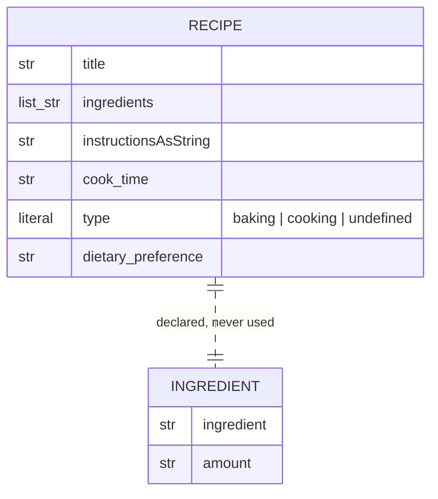
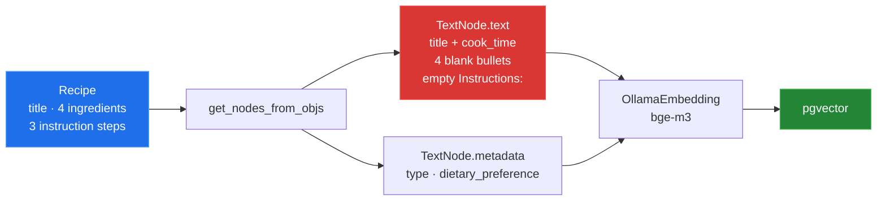

# 3 — Indexing: `util/recipe.py` and `util/embedding_util.py`

[← back to the overview](../README.md) · sources:
[`util/recipe.py`](../util/recipe.py) (31 lines) ·
[`util/embedding_util.py`](../util/embedding_util.py) (55 lines)

Between extraction and storage sits a flattening step: each `Recipe` object is
rendered into one plain-text string, wrapped in a `TextNode` with two metadata
keys, and handed to the embedding model. This is the step that decides what the
vector store can actually match on.

## The schema



`Ingredient` is defined in `util/recipe.py` and is **never imported,
instantiated or referenced** anywhere in the repository — `grep -rn Ingredient`
over the Python sources returns only its own class statement and an unrelated
`"Ingredients:\n"` literal. `Recipe.ingredients` is `List[str]`, not
`List[Ingredient]`.

Two smaller notes on the model:

- The docstring documents `instructions (List[str])`; the field is
  `instructionsAsString: str`.
- `type` is a `Literal["baking", "cooking", "undefined"]`, but the docstring and
  the field description both say only "either baking or cooking".

## The flattening, and what it drops

`get_nodes_from_objs()` builds the node text with `getattr` and defaults
throughout:

```python
recipe_text += f"Title: {getattr(recipe, 'title', 'Unknown Title')}\n"
...
for item in getattr(recipe, 'ingredients', []):
    ingredient = getattr(item, 'ingredient', '')
    amount     = getattr(item, 'amount', '')
    recipe_text += f"- {ingredient}: {amount}\n"
...
for idx, step in enumerate(getattr(recipe, 'instructions', []), 1):
    recipe_text += f"{idx}. {step}\n"
```

Both loops read fields that the current `Recipe` does not have:

| Code reads | `Recipe` actually has | `getattr` default | Effect |
|---|---|---|---|
| `item.ingredient`, `item.amount` on each element | `ingredients: List[str]` — elements are `str` | `''` | every ingredient becomes `- : ` |
| `recipe.instructions` | `instructionsAsString: str` | `[]` | the loop never runs |

Because every read is a `getattr` with a default, nothing raises. The node is
built, embedded and stored — just without the recipe in it.



`tools/node_preview.py` demonstrates it on a fully populated `Recipe`:

```
Title: Pariser Zwiebelsuppe

Cook Time: 45 minutes
Ingredients:
- :
- :
- :
- :

Instructions:
```

```
Ingredient names reached the node text: False
Instruction text reached the node text: False
Characters in: 172   Characters out: 99
```

**Only the title and the cook time are searchable.** The README's example query,
"something vegetarian with lentils", cannot match on "lentils" through the
embedding, because no ingredient name is ever embedded. The `vegetarian` half
survives only as a metadata value, and the default query path does not filter on
metadata unless asked to.

The bullet count is still correct — one `- : ` per ingredient — so a node from a
10-ingredient recipe looks superficially different from a 2-ingredient one
without carrying any of the words.

This is schema drift, not a typo: the field names the code reaches for
(`instructions`, and `Ingredient`-shaped elements) are exactly the shape of the
committed export described in [02 — Extraction](02-extraction.md).
`util/embedding_util.py` was never updated when `Recipe` changed.

## The embedding model

```python
ollama_embedding = OllamaEmbedding(
    model_name="bge-m3",
    base_url="http://localhost:11434",
    ollama_additional_kwargs={"mirostat": 0},
)
```

Three things worth knowing:

- `base_url` is **hard-coded**. Unlike the database settings, there is no
  environment variable; an Ollama daemon on another host or port requires a
  source edit.
- `initEmbeddingModel()` assigns this to `Settings.embed_model`, the global
  `llama_index` setting. That is what makes `VectorStoreIndex(...)` in
  `ingest_recipes.py` embed with bge-m3 rather than with the OpenAI default.
- `bge-m3` is a third required model, and the README's quick start does not
  mention pulling it. Ingestion fails without it.

`get_nodes_from_objs` is annotated `-> TextNode` but returns `List[TextNode]`.

## Metadata

```python
metadata={
    "type": getattr(recipe, 'type', 'Unknown Type'),
    "dietary_preference": getattr(recipe, 'dietary_preference', 'None'),
}
```

These two keys do exist on `Recipe`, so they are populated correctly. They land
in the `metadata_` JSON column. Note that by default `llama_index` includes
metadata in the embedded text as well, which is why the logging call in
`ingest_recipes.py` uses `node.get_content(metadata_mode="all")`.

Neither `cook_time` nor `title` is stored as metadata, so they cannot be used as
a filter — only as embedded prose.

## Next

[04 — Storage](04-storage.md): what lands in PostgreSQL.
