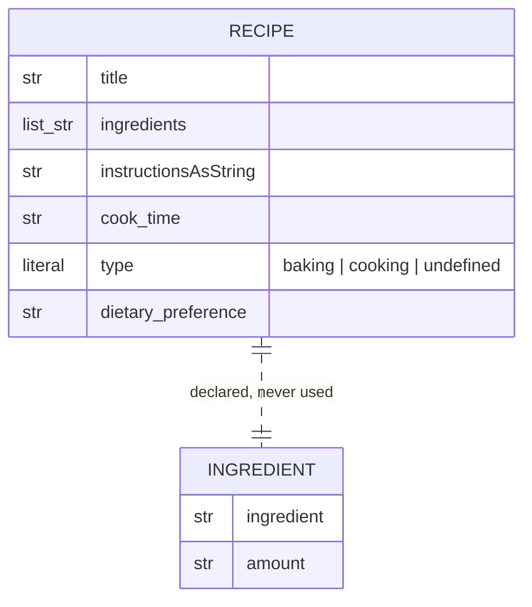
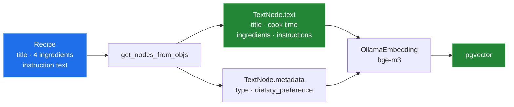

# 3 — Indexing: `util/recipe.py` and `util/embedding_util.py`

[← back to the overview](../README.md) · sources:
[`util/recipe.py`](../util/recipe.py) (32 lines) ·
[`util/embedding_util.py`](../util/embedding_util.py) (51 lines)

Between extraction and storage sits a flattening step: each `Recipe` object is
rendered into one plain-text string, wrapped in a `TextNode` with two metadata
keys, and handed to the embedding model. This is the step that decides what the
vector store can actually match on.

## The schema



`Ingredient` is defined in `util/recipe.py` and is **never imported,
instantiated or referenced** anywhere in the repository — `grep -rn Ingredient`
over the Python sources returns only its own class statement and an unrelated
`"Ingredients:\n"` literal. `Recipe.ingredients` is `List[str]`, not
`List[Ingredient]`.

The class docstring matches the fields. One `Field` description lags behind:
`type` is a `Literal["baking", "cooking", "undefined"]`, but its description
still says "either baking or cooking". That text is part of the schema the
structuring model is shown, so it may make `undefined` less likely to be
chosen; that effect was not measured.

## The flattening

`get_nodes_from_objs()` builds the node text from the fields `Recipe` has:

```python
recipe_text = f"Title: {getattr(recipe, 'title', 'Unknown Title')}\n"
recipe_text += f"\nCook Time: {getattr(recipe, 'cook_time', 'N/A')}\n"
recipe_text += f"Ingredients:\n"
for item in getattr(recipe, 'ingredients', []):
    recipe_text += f"- {item}\n"
recipe_text += "\nInstructions:\n"
recipe_text += f"{getattr(recipe, 'instructionsAsString', '')}\n"
```



`tools/node_preview.py` feeds it a fully populated `Recipe` and prints the
result. Run in a Linux container
([`media/captures/linux-run.txt`](../media/captures/linux-run.txt)):

```
Title: Pariser Zwiebelsuppe

Cook Time: 45 minutes
Ingredients:
- 375 g Zwiebeln
- 50 g Butter
- 40 g Mehl
- 1 l Bruehe

Instructions:
1. Zwiebeln in feine Scheiben hobeln. 2. In Butter glasig duensten. 3. Mehl aufstreuen und aufkochen lassen.
```

```
Ingredient names reached the node text: True
Instruction text reached the node text: True
Characters in: 172 (title + ingredients + instructions)
Characters out: 244
```

Everything the recipe says is in the embedded text, so a question such as
"something vegetarian with lentils" can match on "lentils" through the
embedding. The `vegetarian` half is also a metadata value, but the default
query path does not filter on metadata unless asked to.

Until commit
[`13980e08`](https://github.com/Bissbert/cookingRAG/commit/13980e08) this function read `instructions` and
`Ingredient`-shaped elements, the shape of the older export described in
[02 — Extraction](02-extraction.md), and embedded only the title and cook time.

## The embedding model

```python
EMBED_MODEL = os.environ.get('EMBED_MODEL', 'bge-m3')
OLLAMA_BASE_URL = os.environ.get('OLLAMA_BASE_URL', 'http://localhost:11434')
...
ollama_embedding = OllamaEmbedding(
    model_name=EMBED_MODEL,
    base_url=OLLAMA_BASE_URL,
    ollama_additional_kwargs={"mirostat": 0},
)
```

Three things worth knowing:

- The model and the URL come from `EMBED_MODEL` and `OLLAMA_BASE_URL`, with
  the defaults shown. See [06 — Configuration](06-configuration.md).
- `initEmbeddingModel()` assigns this to `Settings.embed_model`, the global
  `llama_index` setting. Both entry points call it, so ingestion and
  `query_recipes.py` embed with the same model rather than with the OpenAI
  default ([#5](https://github.com/Bissbert/cookingRAG/issues/5)).
- `embedding_dim()` gives the vector width of that model, and the storage layer
  sizes its column with it ([04 — Storage](04-storage.md#the-vector-width)).

`get_nodes_from_objs` is annotated `-> TextNode` but returns `List[TextNode]`.

## Metadata

```python
metadata={
    "type": getattr(recipe, 'type', 'Unknown Type'),
    "dietary_preference": getattr(recipe, 'dietary_preference', 'None'),
}
```

These two keys do exist on `Recipe`, so they are populated correctly. They land
in the `metadata_` JSON column. Note that by default `llama_index` includes
metadata in the embedded text as well, which is why the logging call in
`ingest_recipes.py` uses `node.get_content(metadata_mode="all")`.

Neither `cook_time` nor `title` is stored as metadata, so they cannot be used as
a filter — only as embedded prose.

## Next

[04 — Storage](04-storage.md): what lands in PostgreSQL.
