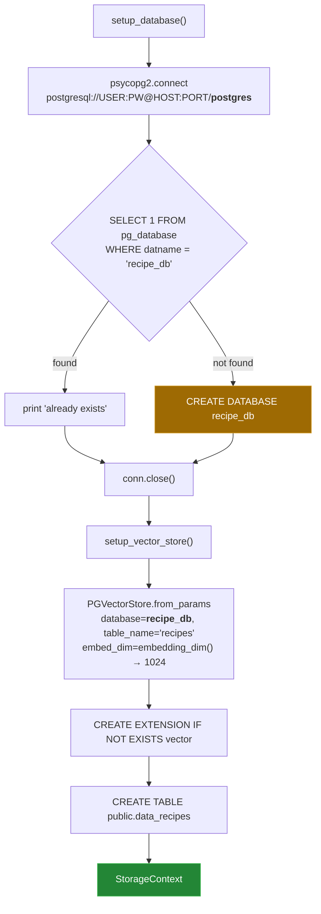

# 4 — Storage: `util/database_conection.py`

[← back to the overview](../README.md) · source:
[`util/database_conection.py`](../util/database_conection.py) · 67 lines ·
2,366 bytes

Two functions. `setup_database()` makes sure the target database exists;
`setup_vector_store()` builds the `PGVectorStore` and wraps it in a
`StorageContext`. Between them they own every database-related decision in the
project.

## Connecting twice, to two databases



The first connection goes to the built-in `postgres` maintenance database —
the connection string hard-codes `/postgres` as the final path segment,
regardless of `PG_DB_NAME`. The second, made by `llama_index`, goes to
`PG_DB_NAME` itself. Creating a database requires a role with `CREATEDB`, which
is one reason the default `PG_USER=postgres` is baked in.

`setup_database()` binds `db_name` as a query parameter in the existence check
and builds `CREATE DATABASE` with `psycopg2.sql.Identifier`, so the name is
quoted as an identifier rather than pasted into the SQL. Against a pgvector
container, with a name that would break unquoted SQL
([`media/captures/linux-run.txt`](../media/captures/linux-run.txt)):

```
$ PG_DB_NAME="recipe-db; x" python3 -c "from util.database_conection import setup_database; setup_database(); setup_database()"
Database 'recipe-db; x' created.
Database 'recipe-db; x' already exists.
```

## The table

The call site says `table_name="recipes"`. The table that appears in PostgreSQL
is **`public.data_recipes`** — `llama_index` prefixes `data_` to the name it is
given. Generated by `tools/show_schema.py` from the pinned library, with no
database involved:

```sql
CREATE TABLE public.data_recipes (
	id BIGSERIAL NOT NULL,
	text VARCHAR NOT NULL,
	metadata_ JSON,
	node_id VARCHAR,
	embedding VECTOR(1024),
	PRIMARY KEY (id)
)
```

| Column | Type | Holds |
|---|---|---|
| `id` | `BIGSERIAL` | surrogate key, assigned by PostgreSQL |
| `text` | `VARCHAR` | the flattened node text from [03](03-indexing.md): title, cook time, ingredients and instructions |
| `metadata_` | `JSON` | `{"type": ..., "dietary_preference": ...}` plus `llama_index` bookkeeping |
| `node_id` | `VARCHAR` | the `TextNode` UUID |
| `embedding` | `VECTOR(1024)` | the bge-m3 vector |

One row per recipe. There is no chunking anywhere in this project: a recipe is
never split, so node count equals recipe count equals, at most, ten per run.

`use_jsonb` is left at its default, so the metadata column is `JSON` rather than
`JSONB` — stored as text, re-parsed on every read, and not indexable with a GIN
operator class.

## No vector index

`hnsw_kwargs` is not passed, so `PGVectorStore` creates no HNSW index, and it
never creates an IVFFlat one. Queries run as a **sequential scan** computing
cosine distance against every row.

For a corpus of ten recipes this is irrelevant and arguably correct — pgvector's
approximate indexes cost recall and only pay off in the thousands of rows. It is
worth stating explicitly because "vector store" tends to imply an index is
present.

## The vector width

The column width comes from the embedding model, not from a literal.
`util/embedding_util.py` holds the model name and its width together:

```python
EMBED_MODEL = os.environ.get('EMBED_MODEL', 'bge-m3')
KNOWN_EMBED_DIMS = {
    'bge-m3': 1024,
}
```

`embedding_dim()` returns, in order:

1. `EMBED_DIM` from the environment, if it is set;
2. the known width of `EMBED_MODEL` (a tag such as `bge-m3:latest` counts as
   `bge-m3`), with no model call;
3. otherwise, the length of one probe embedding from the configured model.

`setup_vector_store()` passes that to `PGVectorStore.from_params(embed_dim=...)`,
and it is the only store setup in the project: the query path calls the same
function (see [Duplicate definition](#duplicate-definition)).

Until [#6](https://github.com/Bissbert/cookingRAG/issues/6) the width was
hard-coded to 1536, the `PGVectorStore` default and OpenAI's width, in two
files. `bge-m3` returns 1024-wide vectors, so pgvector would have rejected the
first insert with `expected 1536 dimensions, not 1024`.

**Existing databases.** A `data_recipes` table created before this change
still has a `VECTOR(1536)` column, and pgvector cannot change a column's width
in place. Drop the table (or the database) and ingest again.

The width `bge-m3` returns on a live Ollama was not measured here: the
containers used for [measurement](measurement.md) have no Ollama models. To
check on a machine that has the model:

```sh
ollama pull bge-m3
python3 - <<'PY'
from llama_index.embeddings.ollama import OllamaEmbedding
e = OllamaEmbedding(model_name="bge-m3", base_url="http://localhost:11434")
print(len(e.get_text_embedding("test")))
PY
```

## The table is created on a new database

`PGVectorStore` creates the `vector` extension and the table the first time the
store is used. The previously pinned `llama-index-vector-stores-postgres==0.3.1`
skipped both whenever the schema already existed. The schema is `public`, which
always exists, so ingest into a new database failed on the first insert with
`relation "public.data_recipes" does not exist`
([#7](https://github.com/Bissbert/cookingRAG/issues/7)). The pin is now
`0.3.2`, which creates the schema, extension and table independently.
`tests/test_pgvector.py` checks this against a real pgvector server.

## Configuration

Every database setting is read once, at **import time**, into module-level
constants:

```python
PG_HOST = os.environ.get('PG_HOST', 'localhost')
...
connection_string = f"postgresql://{PG_USER}:{PG_PASSWORD}@{PG_HOST}:{PG_PORT}/postgres"
```

Setting an environment variable after this module is imported has no effect.
The full table of variables, defaults and failure modes is in
[06 — Configuration](06-configuration.md).

Note the `PG_PASSWORD` default of `'your_database_password'`: there is no
required-variable check anywhere, so forgetting to export it produces a
password-authentication failure from PostgreSQL rather than a clear message from
the application.

## Duplicate definition

`query_recipes.py` used to declare its own copy of all five constants and its
own `setup_vector_store()`, with a second hard-coded width. It now imports
`setup_vector_store()` from this module, so there is one definition. It still
does not call `setup_database()`; it expects the database to exist already.
See [05 — Query](05-query.md).

The filename is spelled `database_conection.py` (one `n`).

## Next

[05 — Query](05-query.md): the retrieval half.
