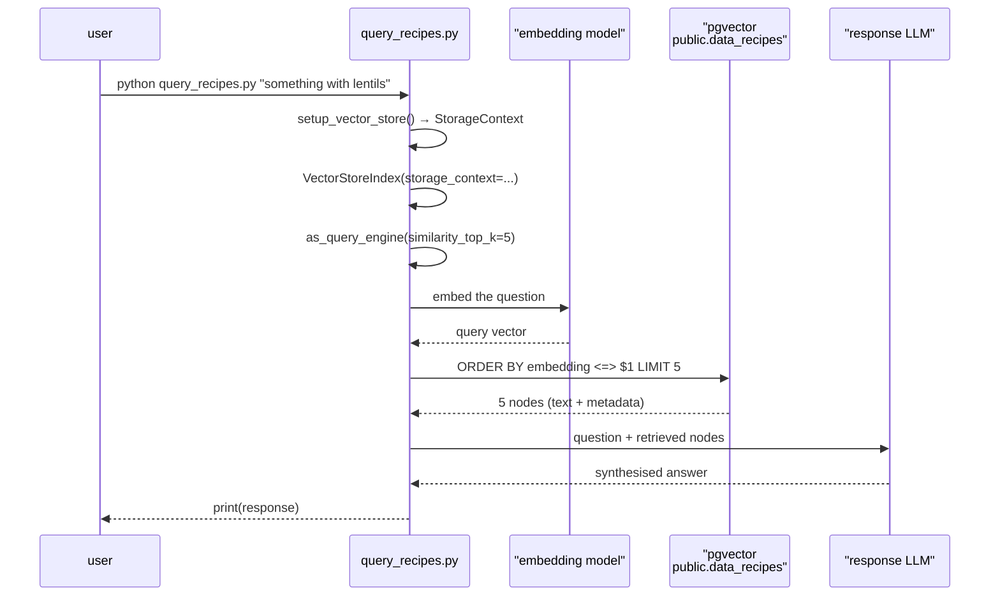
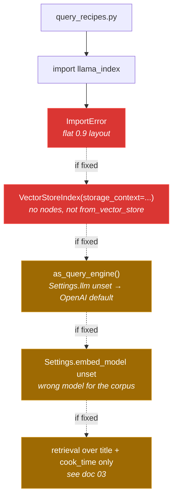

# 5 — Query: `query_recipes.py`

[← back to the overview](../README.md) · source:
[`query_recipes.py`](../query_recipes.py) · 51 lines · 1,683 bytes

The retrieval half of the RAG loop. It is the smaller of the two entry points
and, as committed at the time of this pass, it did not run.

> **Status note.** BUG-02, the pre-0.10 `llama_index` import layout, and
> BUG-03, the index built with no nodes and no vector store, have since been
> fixed on the default branch in commits `418911ae` and `f23d17df`. The module
> imports and reads the persisted vectors. BUG-04 is confirmed and still open:
> no local response or embedding model is configured, so `llama_index` still
> falls back to OpenAI. See [Bugs found](BUGS-FOUND.md).

## It fails at import

```sh
$ python query_recipes.py --help
Traceback (most recent call last):
  File "query_recipes.py", line 5, in <module>
    from llama_index import StorageContext, VectorStoreIndex
ImportError: cannot import name 'StorageContext' from 'llama_index'
```

Both of its `llama_index` imports use the pre-0.10 flat layout. `llama_index`
0.12.2 — the version `requirements.txt` pins — moved everything into
namespaced subpackages:

| Line | In `query_recipes.py` | Where it lives in 0.12.2 |
|---|---|---|
| 5 | `from llama_index import StorageContext, VectorStoreIndex` | `llama_index.core` |
| 6 | `from llama_index.vector_stores import PGVectorStore` | `llama_index.vector_stores.postgres` |

`ingest_recipes.py` and all five `util/` modules already use the new paths and
import cleanly; only this file was left behind. The failure is at module scope,
so it happens before `argparse` runs — even `--help` cannot work.

## What it would do

Reading past the import error, the intended flow is short:



`as_query_engine()` is the retrieve-**and**-generate path: it feeds the
retrieved nodes to an LLM and prints prose, rather than listing the matching
recipes. That distinction matters for the next two problems.

## Three further problems behind the import error

Fixing the imports alone would not make this work.

**1. The index is constructed without nodes.**

```python
index = VectorStoreIndex(storage_context=storage_context)
```

`VectorStoreIndex(...)` is the constructor for *building* an index from nodes.
Loading one that already exists in a vector store is
`VectorStoreIndex.from_vector_store(vector_store)`. As written, this asks for an
index over an empty node list rather than over the stored rows.

**2. No LLM is configured for the generation step.**

`as_query_engine()` needs a response LLM. `query_recipes.py` never sets
`Settings.llm`, never imports `Ollama`, and does not import
`util.ingestion_model_interaction` either. `llama_index`'s default is OpenAI, so
the query path would reach for `OPENAI_API_KEY` — directly contradicting the
README's "no OpenAI key required" claim. `initModel()` in
`util/ingestion_model_interaction.py`, which is the one place that would have
set a local LLM, has its body commented out (see
[02 — Extraction](02-extraction.md)).

**3. No embedding model is configured either.**

`initEmbeddingModel()` is never called here, so `Settings.embed_model` keeps its
default. The question would be embedded with a different model from the one that
embedded the corpus — and at a different width.

Ingestion reaches these settings through `ingest_recipes.py`, which calls
`initEmbeddingModel()` during start-up. Nothing on the query side does.



Even with all four resolved, retrieval would still match only on title and cook
time, because that is all the stored `text` column contains.

## The command line

```python
parser.add_argument('query', type=str, nargs='+',
                    help='Your search query in natural language')
```

`nargs='+'` makes the query **required**, and the words are rejoined with
spaces. The invocation in the current README —

```sh
python query_recipes.py
```

— would therefore fail with `error: the following arguments are required:
query` even if the imports worked. The correct shape is:

```sh
python query_recipes.py something vegetarian with lentils
```

Quoting works too, since the parts are joined either way.

## Retrieval parameters

`similarity_top_k=5` is the only tuned value. With a corpus of at most ten
recipes per ingest run, a top-5 retrieval returns half the collection, so the
ranking barely narrows anything. There is no metadata filter, no minimum
similarity threshold and no reranking step.

## Next

[06 — Configuration](06-configuration.md): every environment variable.
