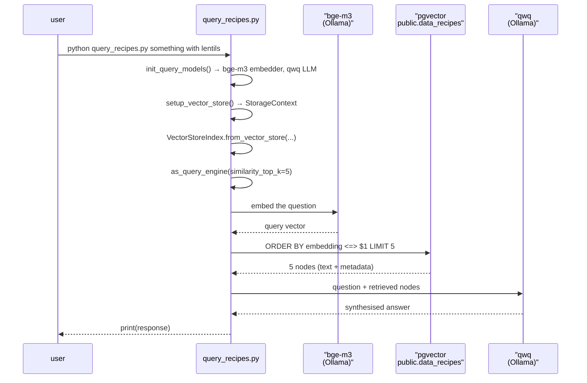
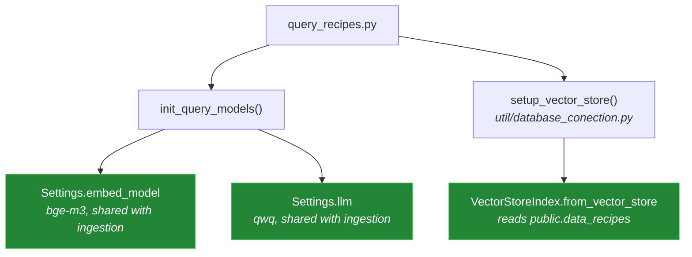

# 5 — Query: `query_recipes.py`

[← back to the overview](../README.md) · source:
[`query_recipes.py`](../query_recipes.py) · 44 lines · 1,448 bytes

The retrieval half of the RAG loop, and the smaller of the two entry points.
It embeds the question with the same local model the recipes were ingested
with (`bge-m3`), reads the stored vectors, and writes the answer with the same
local LLM that structures recipes during ingestion (`qwq`). No OpenAI key is
needed or used.

## The flow



`as_query_engine()` is the retrieve-**and**-generate path: it feeds the
retrieved nodes to an LLM and prints prose, rather than listing the matching
recipes.

## The models

`init_query_models()` runs before anything else in `main()`:

```python
def init_query_models():
    initEmbeddingModel()
    Settings.llm = language_model
```

- `initEmbeddingModel()` sets `Settings.embed_model` to the same
  `OllamaEmbedding` object ingestion uses (`util/embedding_util.py`), so the
  question and the stored recipes are embedded by one model at one width.
- `language_model` is the `Ollama(model="qwq")` object from
  `util/ingestion_model_interaction.py`, so the query path needs no model that
  ingestion does not already need.
- The vector store comes from the shared `setup_vector_store()` in
  `util/database_conection.py`. `query_recipes.py` no longer has its own copy
  of the connection settings or of the vector width.

Before [#5](https://github.com/Bissbert/cookingRAG/issues/5) neither model
was set, and `llama_index` fell back to OpenAI: without an `OPENAI_API_KEY` the
script exited 1 with `No API key found for OpenAI.`



Run in a Linux container against a pgvector server, with no Ollama daemon and
no `OPENAI_API_KEY`
([`media/captures/linux-run.txt`](../media/captures/linux-run.txt)), the
script now stops where it tries to reach Ollama, exit status 1, and nothing in
its output mentions OpenAI:

```
last line: httpx.ConnectError: [Errno 99] Cannot assign requested address
lines mentioning OpenAI: 0
```

The test suite covers the successful path: `tests/test_pgvector.py` ingests two
recipes into a fresh pgvector database with the Ollama models faked, then runs
`query_recipes.main()` and checks that the question was embedded with `bge-m3`
and answered by `qwq` (see [Measurement](measurement.md#test-suite)).

Until commits `418911ae` and `f23d17df` the module did not import at all, and
its index was built with no nodes instead of from the vector store.

## The command line

```python
parser.add_argument('query', type=str, nargs='+',
                    help='Your search query in natural language')
```

`nargs='+'` makes the query **required**, and the words are rejoined with
spaces. Run with no words, it exits with `error: the following arguments are
required: query`. The correct shape is:

```sh
python query_recipes.py something vegetarian with lentils
```

Quoting works too, since the parts are joined either way.

## Retrieval parameters

`similarity_top_k=5` is the only tuned value. With a corpus of at most ten
recipes per ingest run, a top-5 retrieval returns half the collection, so the
ranking barely narrows anything. There is no metadata filter, no minimum
similarity threshold and no reranking step.

## Next

[06 — Configuration](06-configuration.md): every environment variable.
