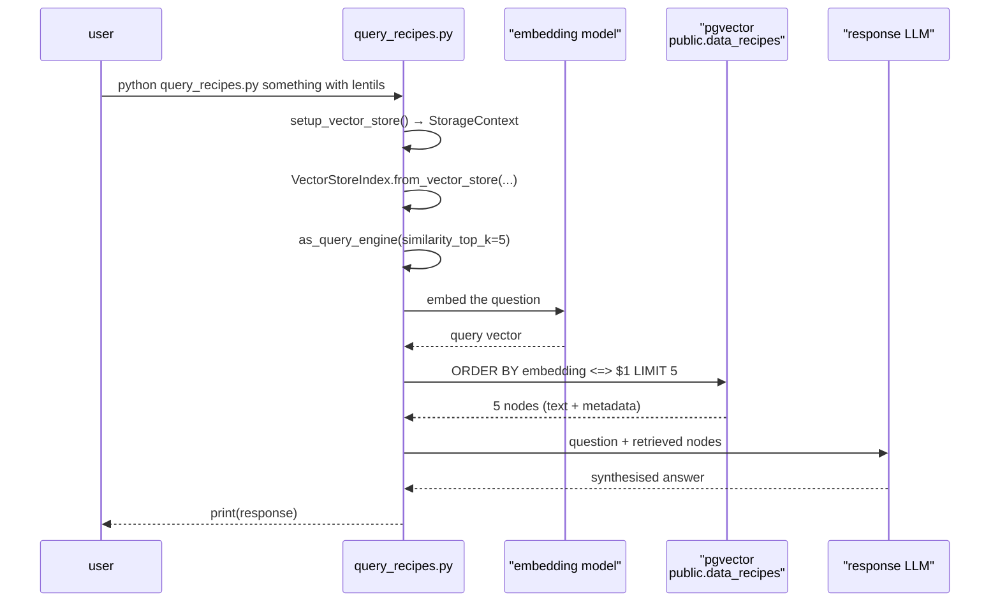
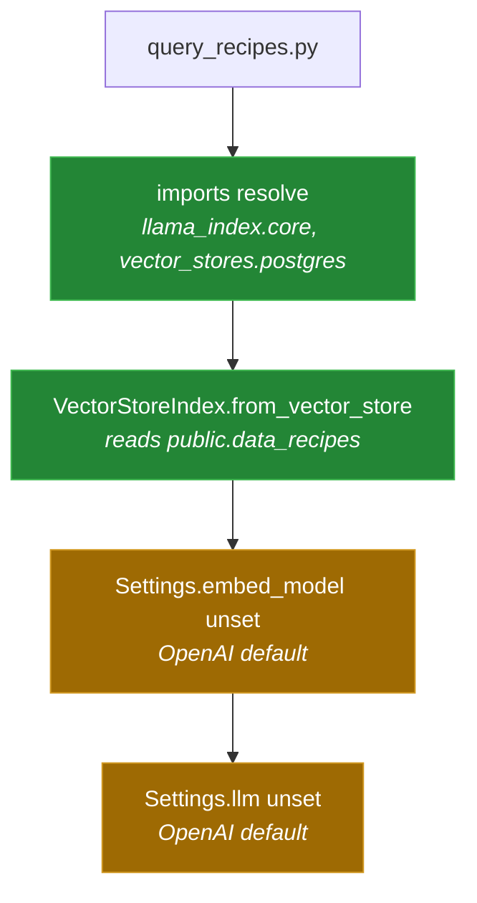

# 5 — Query: `query_recipes.py`

[← back to the overview](../README.md) · source:
[`query_recipes.py`](../query_recipes.py) · 53 lines · 1,740 bytes

The retrieval half of the RAG loop, and the smaller of the two entry points.
It imports against the pinned `llama_index` 0.12.2 and loads the stored
vectors, but it still has no local model configured, so on its own it reaches
for OpenAI ([BUG-04](BUGS-FOUND.md#bug-04), open).

## The flow



`as_query_engine()` is the retrieve-**and**-generate path: it feeds the
retrieved nodes to an LLM and prints prose, rather than listing the matching
recipes.

## What is still missing: the models

`query_recipes.py` never sets `Settings.llm` or `Settings.embed_model`, and does
not call `initEmbeddingModel()`. Both therefore keep `llama_index`'s OpenAI
defaults:

- The question would be embedded by a different model from the one that
  embedded the corpus, and at a different width.
- The answer would be generated by OpenAI, which contradicts the local-only
  premise. `initModel()` in `util/ingestion_model_interaction.py` has its body
  commented out, so it would not help either (see
  [02 — Extraction](02-extraction.md)).

Ingestion reaches the embedding setting through `ingest_recipes.py`, which
calls `initEmbeddingModel()` during start-up. Nothing on the query side does.

Run in a Linux container against a pgvector server, with no `OPENAI_API_KEY`
([`media/captures/linux-run.txt`](../media/captures/linux-run.txt)), the
script gets as far as building the index and stops there, exit status 1:

```
ValueError:
Could not load OpenAI embedding model. If you intended to use OpenAI, please check your OPENAI_API_KEY.
No API key found for OpenAI.
```

Which local models the query path should use, and with what embedding
identity, is a decision the code cannot make on its own: the query embedding
has to match the one the stored vectors were made with.



Until commits `418911ae` and `f23d17df` the module did not import at all, and
its index was built with no nodes instead of from the vector store
([BUG-02](BUGS-FOUND.md#bug-02), [BUG-03](BUGS-FOUND.md#bug-03)).

## The command line

```python
parser.add_argument('query', type=str, nargs='+',
                    help='Your search query in natural language')
```

`nargs='+'` makes the query **required**, and the words are rejoined with
spaces. Run with no words, it exits with `error: the following arguments are
required: query`. The correct shape is:

```sh
python query_recipes.py something vegetarian with lentils
```

Quoting works too, since the parts are joined either way.

## Retrieval parameters

`similarity_top_k=5` is the only tuned value. With a corpus of at most ten
recipes per ingest run, a top-5 retrieval returns half the collection, so the
ranking barely narrows anything. There is no metadata filter, no minimum
similarity threshold and no reranking step.

## Next

[06 — Configuration](06-configuration.md): every environment variable.
