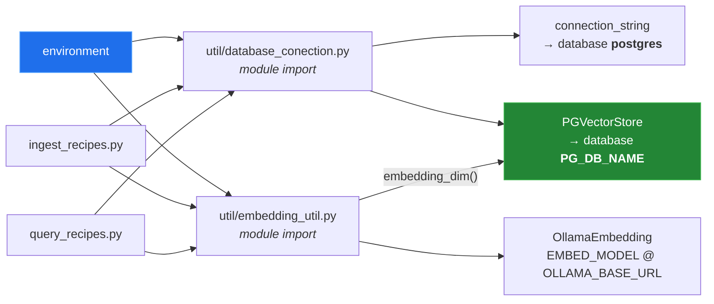

# 6 — Configuration

[← back to the overview](../README.md)

Everything configurable in cookingRAG is an environment variable read at import
time; the rest is hard-coded and requires a source edit.

## Environment variables

The database settings are read once, in
[`util/database_conection.py`](../util/database_conection.py) lines 9–13. The
embedding settings are read in [`util/embedding_util.py`](../util/embedding_util.py)
lines 12–13 and 46. Both entry points use these modules; `query_recipes.py`
has no copy of its own.

| Variable | Default | Used for | If unset |
|---|---|---|---|
| `PG_HOST` | `localhost` | PostgreSQL host | Fine for a local server. |
| `PG_PORT` | `5432` | PostgreSQL port | Fine for a default install. |
| `PG_USER` | `postgres` | PostgreSQL role | Must be able to `CREATEDB`; `setup_database()` issues `CREATE DATABASE`. |
| `PG_PASSWORD` | `your_database_password` | PostgreSQL password | **Breaks.** The literal default is used and PostgreSQL rejects it: `FATAL: password authentication failed`. There is no check for a missing value. |
| `PG_DB_NAME` | `recipe_db` | Database to create and use | Fine. It is quoted as an identifier, so names such as `recipe-db` work. |
| `EMBED_MODEL` | `bge-m3` | Ollama embedding model, for ingest and query | Fine. Changing it on an existing database needs a reindex. |
| `OLLAMA_BASE_URL` | `http://localhost:11434` | Ollama URL for the embedding model | Fine for a local daemon. |
| `EMBED_DIM` | the width of `EMBED_MODEL`: 1024 for `bge-m3` | Width of the `embedding` column | Fine. For a model not in `KNOWN_EMBED_DIMS`, one probe embedding measures it at startup. See [04 — Storage](04-storage.md#the-vector-width). |



Because the reads happen at module scope, `os.environ[...] = ...` after import
has no effect. Export before launching the process.

## Not configurable without editing source

| Value | Set in | Line |
|---|---|---|
| Vision model `llama3.2-vision:90b` | `util/ingestion_model_interaction.py` | 23 |
| Structuring and answering model `qwq` | `util/ingestion_model_interaction.py` | 26 |
| Table name `recipes` → `data_recipes` | `util/database_conection.py` | 63 |
| Request timeout `600.0` s (both models) | `util/ingestion_model_interaction.py` | 23, 26 |
| Retries `3`, delay `5` s | `util/ingestion_model_interaction.py` | 62 |
| Images sampled per run `10` | `ingest_recipes.py` | 23 |
| `similarity_top_k=5` | `query_recipes.py` | 25 |

`OLLAMA_HOST` is **not** honoured. `OLLAMA_BASE_URL` reaches the embedding
model only; the `Ollama`/`OllamaMultiModal` constructors take no `base_url`, so
they use the library default of `http://localhost:11434`. A remote Ollama
still needs a source edit in `util/ingestion_model_interaction.py`.

## Required models

Three, all of which must be present on the Ollama daemon before ingestion:

| Model | Role | Declared in |
|---|---|---|
| `llama3.2-vision:90b` | image → free-text recipe | `util/ingestion_model_interaction.py:23` |
| `qwq` | free text → structured `Recipe`; query answers | `util/ingestion_model_interaction.py:26` |
| `bge-m3` | text → embedding vector, ingest and query | `util/embedding_util.py:12` |

```sh
ollama pull llama3.2-vision:90b
ollama pull qwq
ollama pull bge-m3
```

`llama3.2-vision:90b` is the 90-billion-parameter variant; the download is on
the order of 55 GB and it needs a correspondingly large amount of memory to
serve. `llama3.2-vision:11b` is the smaller sibling, and switching to it is a
one-line edit — but no measurement in this repository says anything about the
quality difference, so that is a substitution to make and then evaluate, not a
recommendation.

## Checking a machine

`tools/envcheck.py` tests all of the above and prints a table:

```sh
python3 tools/envcheck.py
```

It exits 0 only when the daemon is up, all three models are present, and the
PostgreSQL port accepts a connection. It uses the standard library only, so it
runs before the project's dependencies are installed — though it will report
`psycopg2` and `llama_index.core` as missing until they are.

## PostgreSQL requirements

| Requirement | Why |
|---|---|
| Server reachable on `PG_HOST:PG_PORT` | Both connections. |
| Role with `CREATEDB` | `setup_database()` may issue `CREATE DATABASE`. |
| `pgvector` available to install | `PGVectorStore` issues `CREATE EXTENSION IF NOT EXISTS vector`, which needs the extension files present on the server and a role permitted to create extensions (superuser on most installs). |

The `CREATE EXTENSION` is the requirement most easily missed: a stock PostgreSQL
package does not include pgvector. The `pgvector/pgvector` container images ship
it, as do the `postgresql-NN-pgvector` packages on Debian and Ubuntu.

## Back

[← overview](../README.md) · [docs index](README.md)
