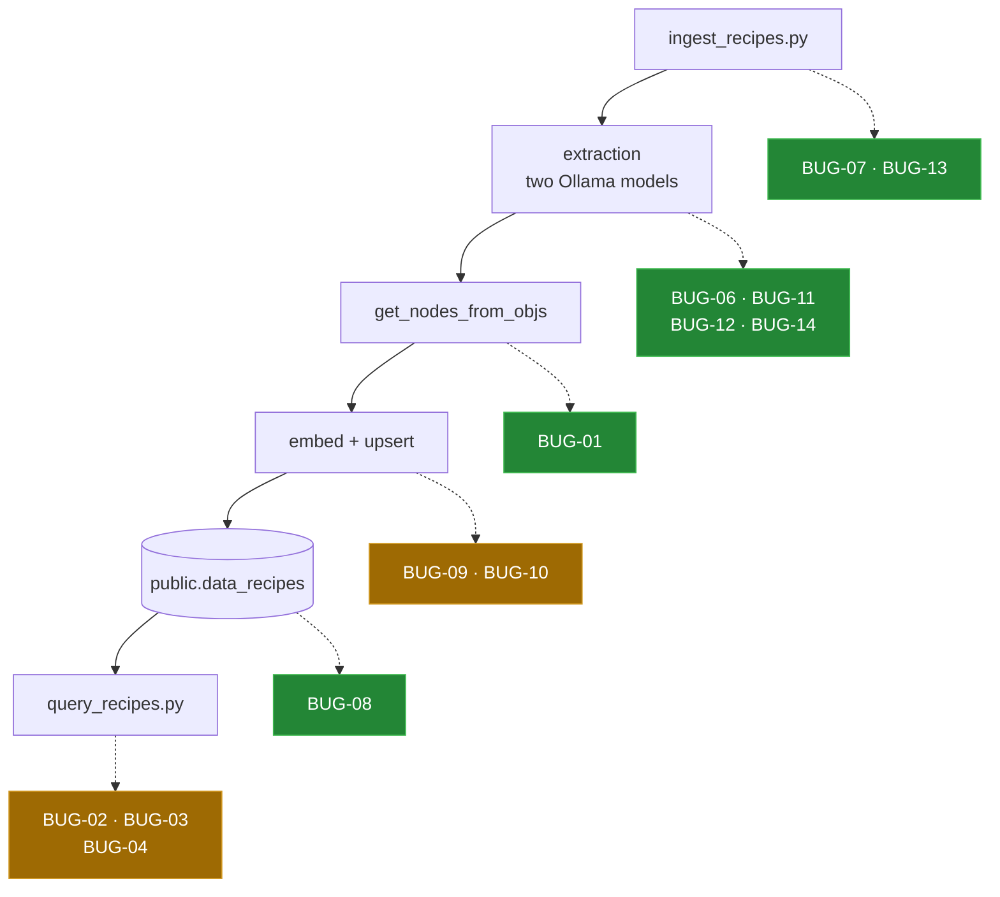

# Bugs found

[← back to the overview](../README.md) · see also
[known limitations](../README.md#known-limitations)

Fifteen defects were found while reading the source. An independent review
confirmed twelve and rejected three (BUG-06, BUG-10, BUG-12). Ten of the twelve
are fixed on the default branch. Two are open because each needs a decision
rather than a patch:

- **BUG-04**: which local models the query path should use, with an embedding
  identity that matches the stored vectors.
- **BUG-09**: a canonical embedding width, with a reindex plan for the existing
  vector column.

Each entry below keeps its original description, reproduction and proposed
diff. The status line under each heading says where it stands now. The other
pages in [`docs/`](README.md) describe the current code.

## Where they land



Amber marks the two places with an open entry: BUG-04 on the query path and
BUG-09 at the embedding width. Everything in green is fixed or was rejected.

## Summary

| ID | File and line | Severity | What happened | Status |
|---|---|---|---|---|
| [BUG-01](#bug-01) | `util/embedding_util.py:38-44` | data loss | Ingredients and instructions never reach the embedded text | Fixed in [`13980e08`](https://github.com/Bissbert/cookingRAG/commit/13980e08) |
| [BUG-02](#bug-02) | `query_recipes.py:5-6` | broken | Module does not import | Fixed in [`418911ae`](https://github.com/Bissbert/cookingRAG/commit/418911ae) |
| [BUG-03](#bug-03) | `query_recipes.py:32` | broken | Index built with no nodes and no vector store | Fixed in [`f23d17df`](https://github.com/Bissbert/cookingRAG/commit/f23d17df) |
| [BUG-04](#bug-04) | `query_recipes.py` (whole) | broken | No LLM and no embedding model set; falls back to OpenAI | Open |
| [BUG-05](#bug-05) | `requirements.txt:3` | broken | Dependency set does not resolve | Fixed in [`8b10cf36`](https://github.com/Bissbert/cookingRAG/commit/8b10cf36) |
| [BUG-06](#bug-06) | `util/ingestion_model_interaction.py:45-51` | broken | `initModel()` is an empty function | Rejected on review |
| [BUG-07](#bug-07) | `ingest_recipes.py:23,41` | surprising | `shuffle` parameter declared and never read | Fixed in [`918f46c9`](https://github.com/Bissbert/cookingRAG/commit/918f46c9) |
| [BUG-08](#bug-08) | `util/database_conection.py:30,33` | injection | Database name interpolated unquoted into SQL | Fixed in [`6ab82c23`](https://github.com/Bissbert/cookingRAG/commit/6ab82c23) |
| [BUG-09](#bug-09) | `util/database_conection.py:59`, `query_recipes.py:25` | likely broken | `embed_dim=1536` hard-coded against `bge-m3` | Open |
| [BUG-10](#bug-10) | `util/json_util.py:16` | deprecation | `recipe.dict()` is removed in pydantic 3 | Rejected on review |
| [BUG-11](#bug-11) | `util/ingestion_model_interaction.py:27,41` | noise | Both prompts printed on import | Fixed in [`1c87901c`](https://github.com/Bissbert/cookingRAG/commit/1c87901c) |
| [BUG-12](#bug-12) | `util/ingestion_model_interaction.py:124-141` | performance | Async scaffolding runs strictly sequentially | Rejected on review |
| [BUG-13](#bug-13) | `ingest_recipes.py:81-83` | data loss | One bad image discards the whole run | Fixed in [`13251ae9`](https://github.com/Bissbert/cookingRAG/commit/13251ae9) |
| [BUG-14](#bug-14) | `util/ingestion_model_interaction.py:76` | robustness | First retry loop catches only `ResponseError` | Fixed in [`85fc8f93`](https://github.com/Bissbert/cookingRAG/commit/85fc8f93) |
| [BUG-15](#bug-15) | `util/recipe.py:24-25` | docs | Docstring contradicts the field declarations | Fixed in [`7693ae8a`](https://github.com/Bissbert/cookingRAG/commit/7693ae8a) |

---

## BUG-01

**Status: Fixed in [`13980e08`](https://github.com/Bissbert/cookingRAG/commit/13980e08).**

**Ingredients and instructions are silently dropped before embedding.**
`util/embedding_util.py:38-44`.

`get_nodes_from_objs()` reads three attributes that the current `Recipe` does
not have. `recipe.ingredients` is a `List[str]`, so `getattr(item,
'ingredient', '')` and `getattr(item, 'amount', '')` on a `str` both return the
default `''`. There is no `recipe.instructions` at all — the field is
`instructionsAsString` — so `getattr(recipe, 'instructions', [])` returns `[]`
and the loop body never executes.

Because every read is a `getattr` with a default, nothing raises. The node text
is built, embedded and stored, and it contains the title and the cook time and
nothing else.

The `Ingredient` model at `util/recipe.py:5-14` has exactly the `.ingredient`
and `.amount` fields this code wants, and is referenced nowhere. The code was
written against an earlier `Recipe` that used `List[Ingredient]` and
`instructions`, and was not updated when the model changed.

Reproduce:

```sh
python3 tools/node_preview.py
```

It builds one fully populated `Recipe`, passes it through the real function,
and prints the node text. Observed: 172 characters in, 99 out, with four
ingredient lines rendered as `- : ` and an empty instructions section.

```diff
--- a/util/embedding_util.py
+++ b/util/embedding_util.py
@@ -35,12 +35,10 @@ def get_nodes_from_objs(recipe_list: List[Recipe]) -> TextNode:
         recipe_text = f"Title: {getattr(recipe, 'title', 'Unknown Title')}\n"
         recipe_text += f"\nCook Time: {getattr(recipe, 'cook_time', 'N/A')}\n"
         recipe_text += f"Ingredients:\n"
-        for item in getattr(recipe, 'ingredients', []):
-            ingredient = getattr(item, 'ingredient', '')
-            amount = getattr(item, 'amount', '')
-            recipe_text += f"- {ingredient}: {amount}\n"
+        for item in recipe.ingredients:
+            recipe_text += f"- {item}\n"
         recipe_text += "\nInstructions:\n"
-        for idx, step in enumerate(getattr(recipe, 'instructions', []), 1):
-            recipe_text += f"{idx}. {step}\n"
+        recipe_text += f"{recipe.instructionsAsString}\n"
 
         node = TextNode(
```

Anything already in the database was embedded by the current code and would
need reingesting.

## BUG-02

**Status: Fixed in [`418911ae`](https://github.com/Bissbert/cookingRAG/commit/418911ae).**

**`query_recipes.py` does not import.** `query_recipes.py:5-6`.

Both imports use the pre-0.10 flat `llama_index` layout against the 0.12.2
pinned in `requirements.txt`, which moved everything into namespaced
subpackages.

Reproduce:

```sh
python query_recipes.py --help
```

Observed — it never reaches `argparse`:

```
ImportError: cannot import name 'StorageContext' from 'llama_index'
```

```diff
--- a/query_recipes.py
+++ b/query_recipes.py
@@ -2,8 +2,8 @@
 
 import os
 import argparse
-from llama_index import StorageContext, VectorStoreIndex
-from llama_index.vector_stores import PGVectorStore
+from llama_index.core import StorageContext, VectorStoreIndex
+from llama_index.vector_stores.postgres import PGVectorStore
```

`util/database_conection.py:3-4` already uses the correct paths, so only this
file is affected.

## BUG-03

**Status: Fixed in [`f23d17df`](https://github.com/Bissbert/cookingRAG/commit/f23d17df).**

**The query index is constructed with neither nodes nor a vector store.**
`query_recipes.py:32`.

`VectorStoreIndex(storage_context=storage_context)` passes `nodes` as `None`
and builds an empty in-memory index. Reading an existing store requires
`from_vector_store`. Even after BUG-02 is fixed, a query would return nothing
from PostgreSQL.

This cannot be reproduced at runtime today; BUG-02 stops execution first.

```diff
--- a/query_recipes.py
+++ b/query_recipes.py
@@ -29,7 +29,9 @@ def setup_vector_store():
 def search_recipes(query, storage_context):
     # Create a query engine
-    index = VectorStoreIndex(storage_context=storage_context)
+    index = VectorStoreIndex.from_vector_store(
+        vector_store=storage_context.vector_store,
+    )
     query_engine = index.as_query_engine(similarity_top_k=5)
```

## BUG-04

**Status: Open: needs a decision on the supported local query models and their embedding identity.**

**No models are configured on the query path.** `query_recipes.py`, whole file.

The module never touches `Settings`. With BUG-02 and BUG-03 fixed, this is
what stops a query:

| Missing | Effect |
|---|---|
| `Settings.embed_model` | The question cannot be embedded with `bge-m3`; `llama_index` falls back to its OpenAI default and needs `OPENAI_API_KEY`. |
| `Settings.llm` | The retrieved nodes cannot be turned into prose locally; same OpenAI fallback. |

This contradicts the project's local-only premise: the ingest path embeds with
`bge-m3` while the query path would embed with an OpenAI model, so the question
vector and the stored vectors would not even share a space.

Reproduced in a Linux container against a pgvector server with no
`OPENAI_API_KEY` ([`media/captures/linux-run.txt`](../media/captures/linux-run.txt)):
`query_recipes.py something vegetarian with lentils` exits 1 with
`Could not load OpenAI embedding model ... No API key found for OpenAI.`

```diff
--- a/query_recipes.py
+++ b/query_recipes.py
@@ -2,8 +2,11 @@
 
 import os
 import argparse
 from llama_index.core import StorageContext, VectorStoreIndex
+from llama_index.core import Settings
+from llama_index.embeddings.ollama import OllamaEmbedding
+from llama_index.llms.ollama import Ollama
 from llama_index.vector_stores.postgres import PGVectorStore
 
@@ -30,6 +33,11 @@
 def search_recipes(query, storage_context):
+    Settings.embed_model = OllamaEmbedding(
+        model_name="bge-m3",
+        base_url="http://localhost:11434",
+    )
+    Settings.llm = Ollama(model="qwq", request_timeout=600.0)
     index = VectorStoreIndex.from_vector_store(
```

Reusing `util/embedding_util.initEmbeddingModel()` would avoid restating the
model name, at the cost of an import from `util/` that this file currently does
not have.

## BUG-05

**Status: Fixed in [`8b10cf36`](https://github.com/Bissbert/cookingRAG/commit/8b10cf36).**

**`requirements.txt` does not resolve.** `requirements.txt:3`.

Reproduce:

```sh
python3 -m venv /tmp/v && /tmp/v/bin/pip install --dry-run -r requirements.txt
```

Observed:

```
The conflict is caused by:
    The user requested pydantic==1.10.17
    llama-index-core 0.12.2 depends on pydantic<2.10.0 and >=2.7.0

ERROR: ResolutionImpossible
```

```diff
--- a/requirements.txt
+++ b/requirements.txt
@@ -1,6 +1,5 @@
 llama_index==0.12.2
 psycopg2_binary==2.9.10
-pydantic==1.10.17
 llama-cloud==0.1.5
 llama-index==0.12.2
```

Removing only that line makes the same file install cleanly (exit 0); pip then
selects pydantic 2.9.2. Note that lines 1 and 5 pin `llama_index` and
`llama-index` separately — the same distribution under two spellings — which
resolves but is redundant.

## BUG-06

**Status: Rejected on review.**

**`initModel()` does nothing.** `util/ingestion_model_interaction.py:45-51`.

The function's only statement is commented out, so its body is the docstring
alone. `ingest_recipes.py:117` calls it during startup and it is a no-op:
`Settings.llm` is never assigned anywhere in the project.

Ingestion survives this because `LLMTextCompletionProgram.from_defaults()` at
line 84 is passed `llm=language_model` explicitly. It matters for anything that
relies on the global, which is what BUG-04 runs into.

```diff
--- a/util/ingestion_model_interaction.py
+++ b/util/ingestion_model_interaction.py
@@ -46,7 +46,7 @@ def initModel():
     Initialize the model settings.
 
     This function sets the global LLM settings to use the initialized Ollama LLM.
     """
-    #Settings.llm = llm
+    Settings.llm = language_model
```

The commented-out line refers to a name `llm` that does not exist in the
module; the model object is called `language_model`.

## BUG-07

**Status: Fixed in [`918f46c9`](https://github.com/Bissbert/cookingRAG/commit/918f46c9).**

**Images are always shuffled, whatever `shuffle` says.**
`ingest_recipes.py:23` and `ingest_recipes.py:41`.

`get_image_files(dir_path, sample=10, shuffle=False)` declares the parameter,
documents it as "Whether to shuffle the image files. Defaults to False", and
then calls `random.shuffle(image_paths)` unconditionally. The parameter is
never read.

Combined with `sample=10` and the fact that `process_recipe_images()` at line
75 passes no overrides, pointing the script at 50 photos ingests a random 10 of
them, and a different 10 next time.

```diff
--- a/ingest_recipes.py
+++ b/ingest_recipes.py
@@ -38,7 +38,8 @@ def get_image_files(
     for image_path in itertools.chain(dir_path.glob("*.jpg"), dir_path.glob("*.jpeg"), dir_path.glob("*.png")):
         image_paths.append(image_path)
 
-    random.shuffle(image_paths)
+    if shuffle:
+        random.shuffle(image_paths)
     if sample:
```

Whether the default should then be `shuffle=True` is a product decision, not a
mechanical fix, which is part of why this is recorded rather than changed.

## BUG-08

**Status: Fixed in [`6ab82c23`](https://github.com/Bissbert/cookingRAG/commit/6ab82c23).**

**The database name is interpolated unquoted into SQL.**
`util/database_conection.py:30` and `util/database_conection.py:33`.

```python
c.execute(f"SELECT 1 FROM pg_catalog.pg_database WHERE datname = '{db_name}'")
...
c.execute(f"CREATE DATABASE {db_name}")
```

`db_name` comes from `PG_DB_NAME` in the environment. A value containing a
quote or a semicolon is executed as SQL. This runs on an `autocommit`
connection as a role that by definition holds `CREATEDB`.

The exposure is limited — an attacker who can set your environment variables
has easier options — but it is also the kind of thing that gets copied into
code where the name comes from somewhere less trusted. `psycopg2.sql` exists
for exactly this.

Reproduce (needs a reachable PostgreSQL, which was not available here, so this
is derived from the source and **not** observed):

```sh
PG_DB_NAME='x"; SELECT 1; --' python ingest_recipes.py ./testRecipes
```

```diff
--- a/util/database_conection.py
+++ b/util/database_conection.py
@@ -1,5 +1,6 @@
 import os
 import psycopg2
+from psycopg2 import sql
 from llama_index.vector_stores.postgres import PGVectorStore
@@ -27,10 +28,13 @@ def setup_database():
     with conn.cursor() as c:
         # Create the database if it doesn't exist
-        c.execute(f"SELECT 1 FROM pg_catalog.pg_database WHERE datname = '{db_name}'")
+        c.execute(
+            "SELECT 1 FROM pg_catalog.pg_database WHERE datname = %s",
+            (db_name,),
+        )
         exists = c.fetchone()
         if not exists:
-            c.execute(f"CREATE DATABASE {db_name}")
+            c.execute(
+                sql.SQL("CREATE DATABASE {}").format(sql.Identifier(db_name))
+            )
```

## BUG-09

**Status: Open: needs a canonical embedding model and a reindex plan for the existing vector column.**

**`embed_dim=1536` is hard-coded while the embedder is `bge-m3`.**
`util/database_conection.py:59` and `query_recipes.py:25`, both carrying the
comment `# Adjust based on your embedding model`.

1536 is the `PGVectorStore` default and the width of OpenAI's
`text-embedding-3-small`. The project embeds with `bge-m3`
(`util/embedding_util.py:9-13`). `tools/show_schema.py` confirms the column is
created as `VECTOR(1536)`.

**The width `bge-m3` actually returns has not been measured**: the containers
used for [measurement](measurement.md) have no Ollama models. The Ollama
metadata for `bge-m3` reports 1024, so this is a code-level observation, not a
confirmed failure. If the widths differ, the first insert fails loudly with a
pgvector dimension error rather than corrupting anything. To check:

```sh
ollama pull bge-m3
python3 -c "from llama_index.embeddings.ollama import OllamaEmbedding; \
print(len(OllamaEmbedding(model_name='bge-m3').get_text_embedding('x')))"
```

A fix that cannot go stale, rather than a second hard-coded number:

```diff
--- a/util/database_conection.py
+++ b/util/database_conection.py
@@ -52,7 +52,7 @@ def setup_vector_store():
         user=PG_USER,
         password=PG_PASSWORD,
         table_name="recipes",
-        embed_dim=1536,  # Adjust based on your embedding model
+        embed_dim=len(Settings.embed_model.get_text_embedding("dimension probe")),
     )
```

This requires `initEmbeddingModel()` to have run first, which
`ingest_recipes.py:118-120` already guarantees. It costs one embedding call per
startup.

## BUG-10

**Status: Rejected on review.**

**`recipe.dict()` is deprecated.** `util/json_util.py:16`.

With the pydantic 2.x that `llama-index-core` 0.12.2 requires, the call still
works but warns:

```
PydanticDeprecatedSince20: The `dict` method is deprecated; use `model_dump` instead.
```

It is removed in pydantic 3.

```diff
--- a/util/json_util.py
+++ b/util/json_util.py
@@ -13,4 +13,4 @@ def recipes_to_json(recipes: List[Recipe]) -> str:
         str: JSON string representation of the recipes.
     """
-    return json.dumps([recipe.dict() for recipe in recipes], indent=4)
+    return json.dumps([recipe.model_dump() for recipe in recipes], indent=4)
```

## BUG-11

**Status: Fixed in [`1c87901c`](https://github.com/Bissbert/cookingRAG/commit/1c87901c).**

**Both prompts are printed at import time.**
`util/ingestion_model_interaction.py:27` and `:41`.

The two `print()` calls sit at module scope, so importing the module — for any
reason, including `--help` — dumps both prompt templates to stdout before
anything runs.

Reproduce:

```sh
python ingest_recipes.py --help
```

Observed: both prompts are printed above the usage text.

```diff
--- a/util/ingestion_model_interaction.py
+++ b/util/ingestion_model_interaction.py
@@ -24,7 +24,7 @@ Do not assume the dietary preference is explicitly stated; instead, infer it log
 
 """
-print("image_extraction_prompt is: ", image_extraction_prompt)
+logging.debug("image_extraction_prompt is: %s", image_extraction_prompt)
@@ -38,7 +38,7 @@ Pydantic Model Definition:
 """
-print("recipe_to_json_template is: ", recipe_to_json_template)
+logging.debug("recipe_to_json_template is: %s", recipe_to_json_template)
```

## BUG-12

**Status: Rejected on review.**

**The async scaffolding does not make anything concurrent.**
`util/ingestion_model_interaction.py:124-141`.

`aprocess_image_files` is `async def` and is awaited, but `aprocess_image_file`
at line 108 is a plain `def` called in a `for` loop, so each image blocks. The
intended implementation is on line 140, commented out, and `run_jobs` is still
imported at line 5 for it. The `print` at line 139 announces "created all
tasks, now running processing" after the processing has already finished.

Two model round-trips per image, strictly one image at a time.

```diff
--- a/util/ingestion_model_interaction.py
+++ b/util/ingestion_model_interaction.py
@@ -105,7 +105,7 @@
     return output
 
-def aprocess_image_file(image_file):
+async def aprocess_image_file(image_file):
@@ -131,10 +131,5 @@ async def aprocess_image_files(image_files):
-    outputs = []
-    for image_file in image_files:
-        output = aprocess_image_file(image_file)
-        outputs.append(output)
-
-    print("created all tasks, now running processing")
-    #outputs = await run_jobs(tasks, show_progress=True, workers=5)
-    return outputs
+    tasks = [aprocess_image_file(f) for f in image_files]
+    return await run_jobs(tasks, show_progress=True, workers=5)
```

`pydantic_llm` is synchronous throughout, so this alone would not yield real
parallelism until the model calls become awaitable. `workers=5` against a 90B
vision model on one GPU may also be slower than sequential. This one needs
measurement before it is worth applying, and none was possible here.

## BUG-13

**Status: Fixed in [`13251ae9`](https://github.com/Bissbert/cookingRAG/commit/13251ae9).**

**A single failed image discards every recipe in the run.**
`ingest_recipes.py:81-83`.

```python
dataObjects = await aprocess_image_files(imageFiles)
save_data_objects_to_json(dataObjects)
nodes = get_nodes_from_objs(dataObjects)
```

There is no `try` anywhere in the per-image path. `pydantic_llm` re-raises after
its last retry (lines 81 and 104), that propagates through the loop in
`aprocess_image_files`, and `process_recipe_images` never reaches the JSON
export or the database write. Both happen only after *every* image has been
processed, so a failure on image 9 of 10 loses the other nine — including
around a dozen minutes of vision-model work per image.

```diff
--- a/util/ingestion_model_interaction.py
+++ b/util/ingestion_model_interaction.py
@@ -132,7 +132,11 @@ async def aprocess_image_files(image_files):
     outputs = []
     for image_file in image_files:
-        output = aprocess_image_file(image_file)
-        outputs.append(output)
+        try:
+            outputs.append(aprocess_image_file(image_file))
+        except Exception:
+            logging.exception("Skipping %s", image_file)
```

Writing the export incrementally instead of once at the end would be the
sturdier fix, but it is a larger change than a bug record should propose.

## BUG-14

**Status: Fixed in [`85fc8f93`](https://github.com/Bissbert/cookingRAG/commit/85fc8f93).**

**The first retry loop catches only `ResponseError`.**
`util/ingestion_model_interaction.py:76`.

The vision-model loop catches `ollama._types.ResponseError`. The structuring
loop twenty lines later catches bare `Exception`. A connection reset or a read
timeout against the vision model — the plausible failure at a 600-second
timeout — is therefore not retried, and takes the whole run down via BUG-13.

The asymmetry looks unintentional rather than considered.

```diff
--- a/util/ingestion_model_interaction.py
+++ b/util/ingestion_model_interaction.py
@@ -73,7 +73,7 @@ def pydantic_llm(output_class, image_documents, image_extraction_prompt, recipe_
             logging.info("Recipe extraction successful.")
             logging.info(recipe)
             break
-        except ResponseError as e:
+        except Exception as e:
             logging.error(f"Attempt {attempt + 1} failed with error: {e}")
```

Catching `Exception` is what the other loop already does; narrowing both to the
transport errors that are actually worth retrying would be better still.

## BUG-15

**Status: Fixed in [`7693ae8a`](https://github.com/Bissbert/cookingRAG/commit/7693ae8a).**

**The `Recipe` docstring contradicts the fields below it.**
`util/recipe.py:24-25`.

| Docstring says | Field actually is |
|---|---|
| `type (Literal["baking", "cooking"])` | `Literal["baking", "cooking", "undefined"]` (line 31) |
| `dietary_preference (Literal["vegan", "vegetarian", "meat"])` | plain `str`, unconstrained (line 32) |

The second matters: the docstring is the contract a reader relies on, and the
model accepts any string at all. The committed export contains
`"dietary_preference": "vegetarian"` throughout, but nothing would reject
`"probably fine"`.

```diff
--- a/util/recipe.py
+++ b/util/recipe.py
@@ -21,8 +21,8 @@ class Recipe(BaseModel):
         instructionsAsString (str): Step-by-step cooking instructions.
         cook_time (str): Cooking time in a readable format (e.g., '30 minutes').
-        type (Literal["baking", "cooking"]): Type of recipe: either baking or cooking.
-        dietary_preference (Literal["vegan", "vegetarian", "meat"]): Dietary preference for the recipe: vegan, vegetarian, or meat-based.
+        type (Literal["baking", "cooking", "undefined"]): Type of recipe.
+        dietary_preference (str): Free-text dietary preference, not validated.
     """
```

Constraining the field to the documented `Literal` instead would be a
behaviour change: the extraction prompt at
`util/ingestion_model_interaction.py:24` asks the model for a short free-text
preference, so validation would start rejecting output that is accepted today.

## Not bugs

Three things that look wrong at a glance and are not:

| Observation | Why it is fine |
|---|---|
| `util/database_conection.py:13` connects to `/postgres`, not `PG_DB_NAME` | Correct. You cannot `CREATE DATABASE` from inside the database you are creating; connecting to the `postgres` maintenance database is the standard approach. |
| `ingest_recipes.py:91` assigns `index` and never uses it | Constructing `VectorStoreIndex` is what embeds and upserts. The side effect is the point; the unused name is untidy, not broken. |
| The five PG constants appear in both `query_recipes.py:11-15` and `util/database_conection.py:7-11` | Duplicated, but byte-for-byte identical — `diff` of the two ranges is empty. Worth consolidating; not currently a source of divergent behaviour. |
